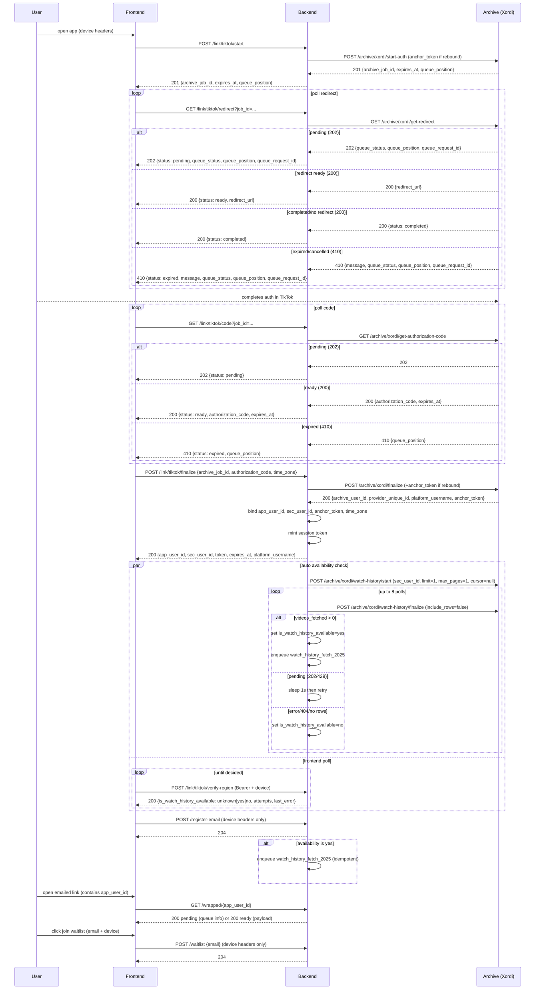

# TikTok Wrapped Backend - Design (see `flow.md`)

This file used to describe the original frontend-driven `/link/tiktok/code` + `/link/tiktok/finalize` flow.
The **current** flow is redirect-driven finalize (worker-only). Treat any sections below that mention FE polling
`/link/tiktok/code` or calling `/link/tiktok/finalize` as **legacy**.

## Core principles
- Device-bound link flow (X-Device-Id + platform/app/os headers). Bearer token is minted by the **worker** after Xordi finalize and is returned by `GET /link/tiktok/redirect` when it reaches `status="completed"`.
- Canonical `app_user_id` = Archive `archive_user_id` from finalize; used as a semi-secret in emailed links (`/wrapped?app_user_id=<app_user_id>`).
- Watch-history availability flag: `is_watch_history_available` = `unknown|yes|no`. Availability is a tiny watch-history fetch; on `yes` we auto-enqueue the wrapped pipeline, on `no` we stop.
- Persist `platform_username` and `time_zone` during worker finalize.

## Flow (high level)
1) **Link (device-bound)**: `POST /link/tiktok/start` → FE polls `GET /link/tiktok/redirect?job_id=...&time_zone=...` until:
   - `status="ready"` (gets `redirect_url` to open in TikTok), then keeps polling
   - `status="completed"` (gets `{app_user_id, token, expires_at}`)
   Backend enqueues a worker job to poll authorization code and call Archive finalize.
2) **Availability check**: backend probes availability immediately after finalize; FE does not need to call anything. `POST /link/tiktok/verify-region` still exists (Bearer + device) for debugging/manual retries.
3) **Email capture**: `POST /register-email` (device headers only) stores an email tied to the device and best-effort attaches it to the finalized user.
4) **Wrapped pipeline** (auto on availability `yes`):
   - `watch_history_fetch_2025`: walk back in time from “now” to `WATCH_HISTORY_SINCE_DATE` (default `2025-01-01`) by repeatedly calling `watch-history/start` with `cursor` (ms), `limit` = `WATCH_HISTORY_PAGE_LIMIT` (default 200), `max_pages` = `WATCH_HISTORY_MAX_PAGES` (default 3), then polling `watch-history/finalize` with `include_rows=false` until complete. Continue while `pagination.has_more=true` and `pagination.next_cursor >= since_ms`. After syncing, compute wrapped inputs via stored analytics (`POST /archive/xordi/watch-history/analytics/summary` and `.../samples`) rather than paging stored rows.
   - `wrapped_analysis`: compute metrics; call LLM via OpenRouter (`OPENROUTER_API_KEY`, `OPENROUTER_MODEL`) with prompts in `app/prompts.py`.
   - `email_send`: SES (`AWS_ACCESS_KEY_ID/SECRET`, `AWS_REGION`, `AWS_EMAIL`) with link `/wrapped?app_user_id=<app_user_id>`.
5) **Result + waitlist**: email link opens the frontend with `app_user_id` in the query string; frontend calls public `GET /wrapped/{app_user_id}` for pending/ready payload. `POST /waitlist` is device-only and takes `{email}` so auth-failed users can still opt in.

## Wrapped output (payload fields)
- Totals: `total_videos`, `total_hours`, `night_pct`, `peak_hour`.
- Top items: `top_music` (with count), `top_creators` (top 5).
- Presentation: `cat_name`, `accessory_set`, `analogy_line`, `scroll_time` (`{title, rate, between_time}` where `rate` is a % and `between_time` is the peak window).
- Personality: `personality_type`, `personality_explanation` (LLM).
- Journey/niche: `niche_journey` (5 words), `top_niches`, `top_niche_percentile` (LLM).
- Brainrot: `brain_rot_score`, `brain_rot_explanation` (LLM).
- Future/roast: `keyword_2026` (LLM), `thumb_roast` (LLM).
- Metadata: `platform_username`, `email`, `source_spans`, `data_jobs`.

## API surface (current targets)
- **Device-bound (no Bearer)**: `POST /link/tiktok/start`, `GET /link/tiktok/redirect`, `GET /link/tiktok/queue-status`.
- **Legacy (frontend should not call)**: `GET /link/tiktok/code`, `POST /link/tiktok/finalize`.
- **Debug (Bearer + device)**: `POST /link/tiktok/verify-region`.
- **Device-only**: `POST /register-email`, `POST /waitlist`.
- **Public**: `GET /wrapped/{app_user_id}`, `POST /referral`, `POST /referral/impression`.

## Queue / workers
- DB-backed queue with row locks; safe for multiple workers. Task names: `watch_history_fetch_2025` (batched month sync + analytics), optional LLM fan-out tasks (`llm_personality`, `llm_personality_explanation`, `llm_niche_journey`, `llm_top_niche_percentile`, `llm_brainrot`, `llm_brainrot_explanation`, `llm_keyword_2026`, `llm_thumb_roast`), `wrapped_analysis` (sequential fill), and `email_send` (SES).
- Rate limits: rely on Archive's queue; `start`/`finalize` handle 429 with backoff; `finalize` polls up to 300 iterations with 2-10s waits from `queue_position`.

## Config
- Archive: `ARCHIVE_BASE_URL`, `ARCHIVE_API_KEY`.
- DB: `DATABASE_URL` (Neon). Add pooling limits when deploying multiple instances.
- Secrets: `SECRET_KEY` (itsdangerous), `OPENROUTER_API_KEY`, `OPENROUTER_MODEL`.
- Email: `AWS_ACCESS_KEY_ID`, `AWS_ACCESS_KEY_SECRET`, `AWS_REGION`, `AWS_EMAIL`.

## Analysis
	for each user
	    concurrently fetch their watch history across different month
	        (for each month, start/finalize with cursor = month end ms and `max_pages=WATCH_HISTORY_MAX_PAGES`, repeat via `pagination.next_cursor` until the month start is crossed; then query `/archive/xordi/watch-history/analytics/summary` + `/archive/xordi/watch-history/analytics/samples`)
    after getting the watch history, can now calculate:
    - total number of videos watched
        - roasts like "Your thumb ran 26 miles on the screen - that's basically a full marathon." -> LLM
    - total watch time (calculated via approx times watched * video's duration)
    - top music (and how many times did that music appear)
    - top 5 creators
    - how many percent of the user's scrolling time falls in the night time zone
    - the user's peak scrolling time (calculate by peak activity hours)
    - the user's personality type (LLM query, context being a reasonably sized sample of the user's watch history)
    - explanation for why the personality type
    - the user's 2025 niche interest journey (generate 5 words, each for a peiord of interest) (use LLM)
    - the user's top 2 niche interests (that they are deeply invested in)
    - the user's top niche interest (and how "top n%" is that user) -> use LLM
    - brainrot score for the user -> use LLM
    - explanation for why the brainrot score
    - keyword for 2026
    - three accessories dropped based on wathc history (one head, one body, one other, take from items.csv)

in wrapped results, store:
- username on tiktok
- email
- information above

## Mermaid
Updated auth + availability sequence (front/back/Archive):

## Scaling plan (queue + concurrency)
- Goals: keep worker memory small (no full history reads), bound Archive/LLM calls, and avoid duplicate fetches per user while staying restart-safe.
- Tunables (env-driven):
  - `WATCH_HISTORY_SINCE_DATE` / `WATCH_HISTORY_SINCE_MS`: lower bound for cursor-walk (default `2025-01-01` UTC).
  - `WATCH_HISTORY_PAGE_LIMIT` (default 200): provider page size (passed to `watch-history/start`).
  - `WATCH_HISTORY_MAX_PAGES` (default 3): provider pages per `watch-history/start` call.
  - `LLM_CONCURRENCY` (per-worker semaphore, e.g., 2-4).
- Archive throttling: rely on Archive's own queue; we don't add extra global or per-account guards beyond the per-user month concurrency above.
- Fetch scope & latency: start at “now” and keep stepping `cursor=pagination.next_cursor` while `has_more` and `next_cursor >= since_ms`. After syncing, call stored analytics endpoints (`/analytics/summary` + `/analytics/samples`) using a `between` range (`start_at=since`, `end_at=now`) to compute the wrapped inputs.
- Pipeline stages:
  1) `watch_history_fetch`: sync rows into Archive, then fetch analytics + samples, record `data_jobs.watch_history` status.
  2) `wrapped_analysis`: gated by `LLM_CONCURRENCY`; on missing config/budget, mark failed gracefully and keep aggregates.
  3) `email_send`: separate, small task.
- Backoff/retries: keep max_attempts/backoff for start/finalize; on sustained 429/424, requeue with `not_before`. Lease expiry already reclaims stuck jobs after restart.
- Observability: enrich `data_jobs` with `{status, error?, attempts, queue_position?, pagination?}` for watch_history; log durations to spot bottlenecks.
- No S3/object storage in this plan; responses stay bounded. If audit/replay becomes necessary later, we can add object storage + manifest, but payload stays small.
